# Pharo key features

Pharo is a pure object-oriented programming language and a powerful environment. For more details, see [http://pharo.org/](http://pharo.org).

It benefits from an elegant design that enables a relatively simple implementation of many advanced programming techniques. Here are some of them:

## The optional fusion of a developed program and development environment

-   In Pharo, the border between your program and IDE can be eliminated. That means that you may directly use your code for a visual representation of your data structures during debugging, and easily modify the built-in tools to fit your needs, etc.

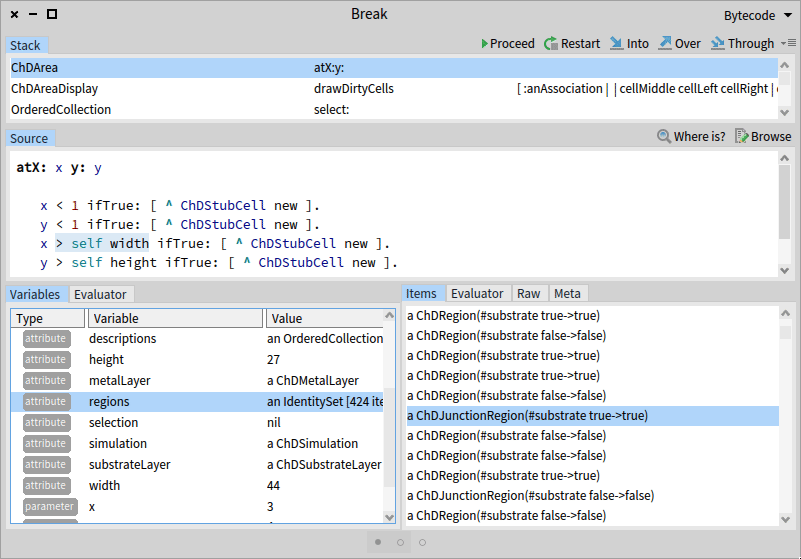
>*On a breakpoint, use the custom circuit region visual representation in the debugger, run another debugger on a piece of code inside the original debugger, edit the circuit inside the debugger and continue in stepping*

## Advanced run-time reflection

-   Pharo exposes everything to the programmer. Every object in the system can be examined and changed with respect to the object encapsulation rules.
-   Pharo can enumerate all objects that have reference to some object.

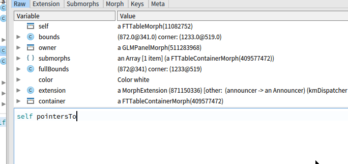
> *Open inspector on some window instance, find all objects that have reference to it and investigate them*

## Pure object-oriented approach

-   In Pharo, everything is an object. This purity and uniformity in the system and language design makes Pharo clean and comfortable to learn.

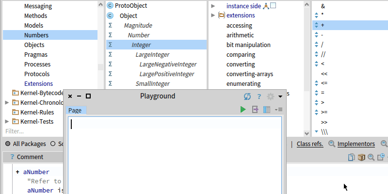
> *True is instance of the class named True that has methods for control structures (like ifTrue:) that work with closures*  

## Software as objects

-   Pharo uses files for serialization of source code, but, by default, it does not use files to edit them. Instead of a text editor, it provides the tools to browse and modify the classes, methods, class comments and other program entities. So Pharo has a much better understanding of relations between them and allows easier navigation and refactorings.

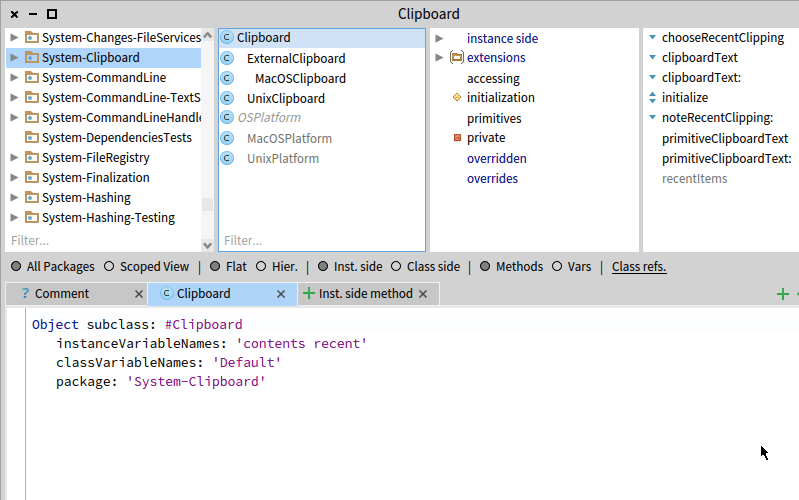
> *Find all references to a class, all method implementors and senders*

## Simple language syntax

-   The language syntax has only six reserved words
-   Since the grammar is LL(1), it is very fast to parse
-   Easy to learn
-   Pharo is designed for message passing without argument ambiguity

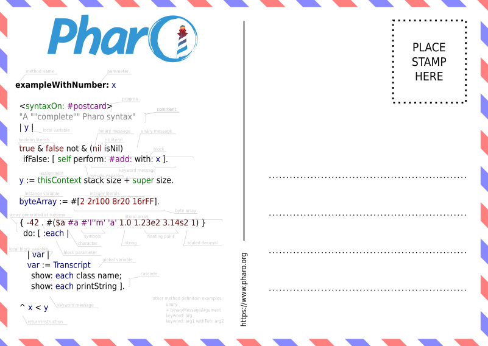
> *All language elements that you can find in Pharo fit on a single postcard*

## Closures with non-local returns

-   The closures in Pharo with non-local returns allow elegant implementation of control structures without needing to define them in the language itself. Pharo is a simple meta-language where the programmer has all features required for the writing of custom readable domain-specific languages.

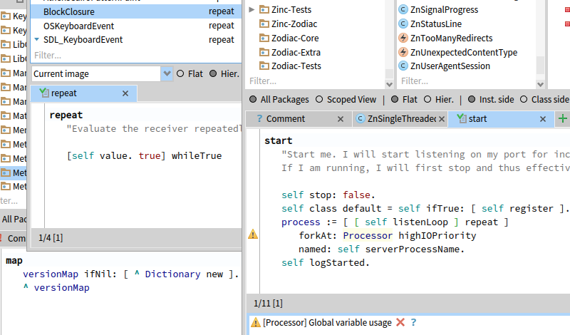
> *Show implementaion and usage of message repeat. A method (map) that contains closure with non-local return*

## Immediate objects identity swapping

-   In Pharo, you can easily replace an object with another one. All references to the old object in your running program will be replaced by references to the new object.

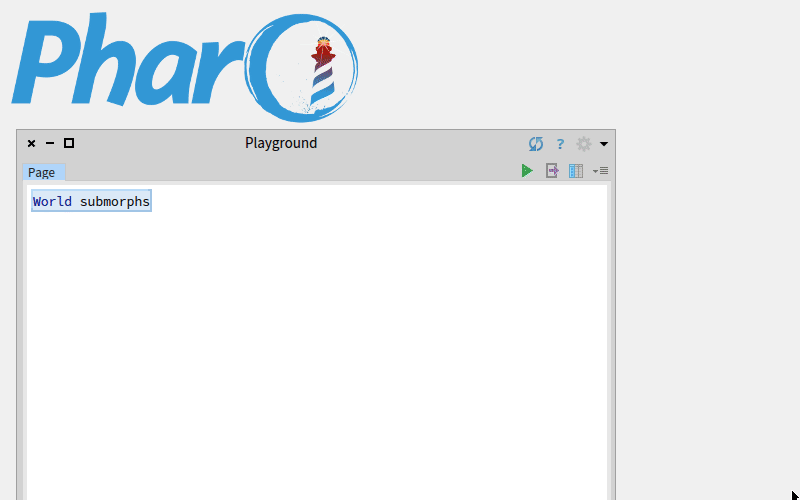
> Inspect all graphical elements on desktop, find logo, create new picture from a display region selected by the user and change identity of the logo object to this new picture*

## Fast resumable exceptions

-   Pharo provides advanced exceptions system that can do things like resuming from a raised exception with providing an alternative result so your program can recover from failures.
-   Their fast speed allows them to be used for clean information-flow mechanisms.

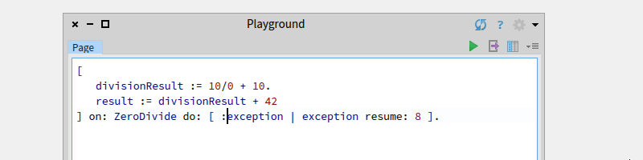
> *Provide an alternative result of the faulty expression that tries the division by zero*

## Live customizable objects inspection

-   You can visualize your objects in many ways (textual form, graphical representation) and use it to inspect the state of your running program. Debuggers can use these visualizations to help you to your understanding.

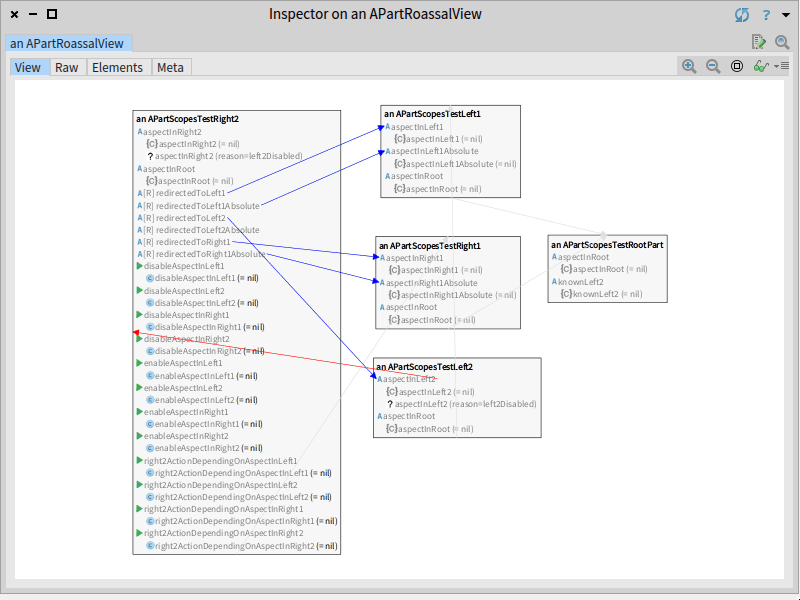
> *Inpsect an object graph with help of custom interactive visual object representations*

## Run-time classes and objects migration

-   Pharo can evolve while it's running. It is like an organism. You can do things like add or remove instance variables of classes that have already existing instances. All these living instances will be properly modified.

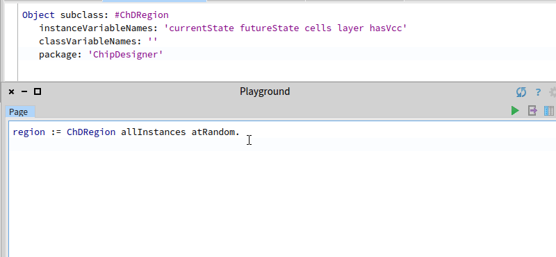
> *Look at some random instance of a class and add new variable to this class*

## Dynamic inheritance

-   You can change the definition of existing classes including changing its superclass. To some selected object, you can simply assign a different class and do similar operations. These capabilities are essential for the ability of the system to evolve without the need for restarts.

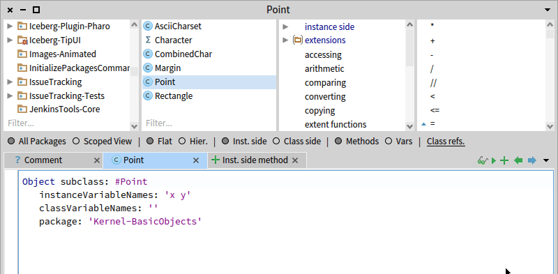
> *Count all living instances of a class Point, create a new class with half of its original variables and use it as new superclass of Point while the graphical system is running*

## Advanced fast multi-platform virtual machine with JIT, combined generational garbage collector, ephemerons, forwarders

-   Pharo uses a very fast virtual machine with many unique features that runs on Windows, macOS and Linux including the ARM processors

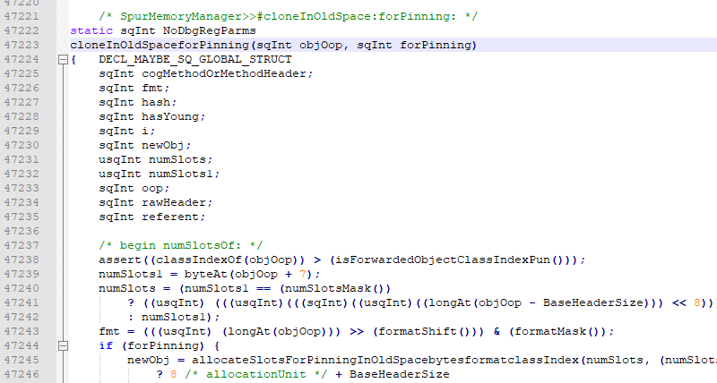
> *A part of the garbage collector sources that deals with pinned objects that have stable memory location*

## Virtual machine written mostly in the language itself

-   For more natural understanding and debugging of the virtual machine, it is mostly written in Pharo.

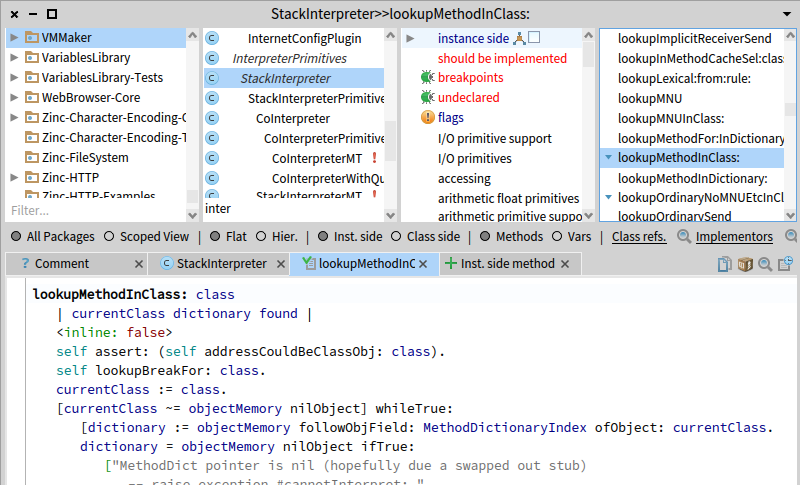
> *You can use all benefits of the Pharo IDE during writing of the virtual machine code. The source is then translated to C.*

## Easy call stack manipulation

-   You can easily inspect, modify or serialize the call stack. This allows, among other things, much easier building of debugging tools.

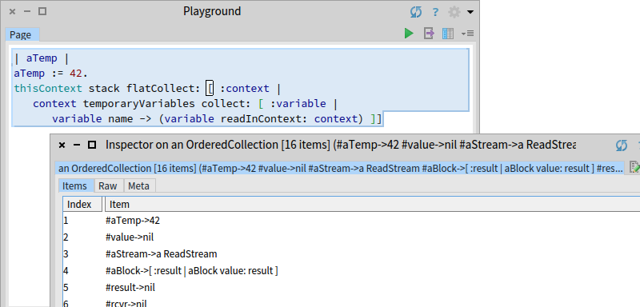
> *Inspect all temporary variables with values in the current call stack*

## Continuations

-   Call stack manipulation allows surprisingly easy implementation of continuations without the need for direct support of the virtual machine. The continuations are very handy for web development tasks and backtracking implementation.

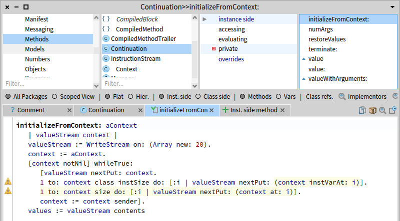
> *Continuations are implemented in a very small elegant class*

## Fast objects enumeration

-   With the Pharo reflection, you can easily enumerate all existing instances of a particular class and investigate references to them. It is beneficial for detecting memory leaks. It is an essential Pharo reflectivity feature.

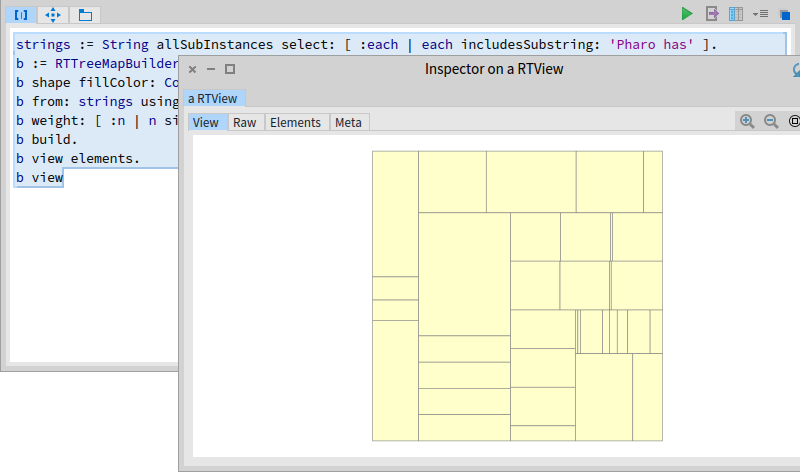
> *Find all existing strings that contain subsctring 'Pharo has' and visualize them as a tree map according their sizes*

## Objects as methods

-   Methods are objects and objects can serve as methods. In this case, the invoking of a method means that the object receives a special message. It may be used for example during the coverage testing. You replace all class methods with such proxy objects, and when called, these objects replace themselves with the original method and write this information to a log.

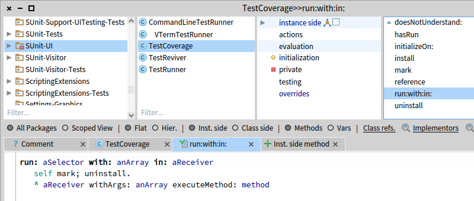
> *To implement per-method coverage is matter of few lines of code*

## Traits

-   Pharo classes use single inheritance, but they can use stateful traits for sharing of behavior with other classes.

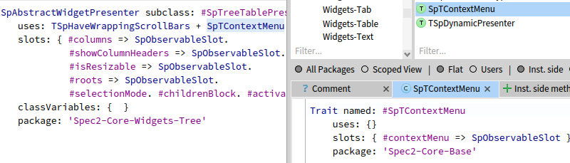
> *Tree table uses a stateful trait that extends its behavior with the ability to have a context menu*

## Optional Green threads

-   Pharo includes own process management that allows using concurrent programming even on platforms that do not support it.

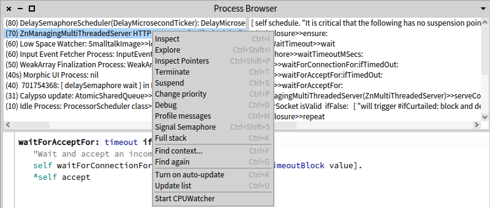
> *Built-in Pharo process manager*

## AST metalinks

-   Abstract syntax tree of methods can be extended by metalinks that enable doing additional operations before, after or instead of particular AST nodes. That allows the clean first-class implementation of features like breakpoints, coverage testing, variables that remember old values, etc.

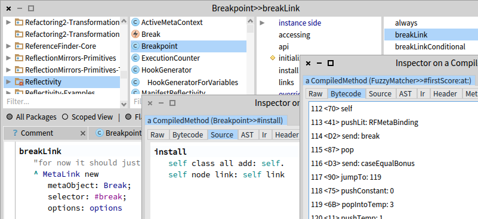
> *Installation of a breakpoint on an AST node. Example bytecode of a method with breakpoint.*

## First-class customizable instance variables

-   The metalinks allow the implementation of much smarter instance variables like variables that keep bidirectional managed references between two objects. A simple assignment then automatically updates the other side of the reference, too. 

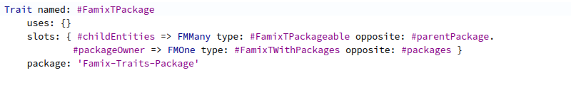
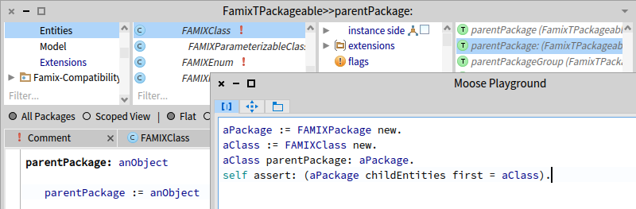
> *Part of a general language meta-model that defines many-to-one relation between package and its owner. When you secify a class package with a simple assignment, the class is added to the child entities collection of the package automatically.*

## Customizable metaclasses

-   Objects have classes and classes have classes, too, the metaclasses. These metaclasses have a class, too, and Pharo allows using custom ones. It allows having the implementation of language features like traits as standalone libraries without any direct support in the virtual machine.

> *Metaclasses*

## Relatively low memory consumption

-   Pharo, including the virtual machine, is very compact with fast startup time.

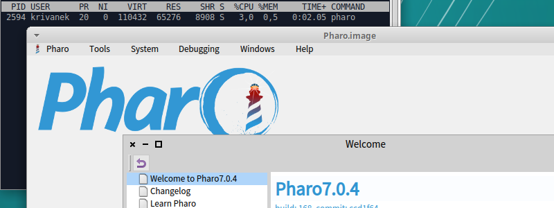
> *The Pharo IDE in the default configuration consuming 64MB of the physical memory*

## Platform-independent user interface

-   The default Pharo UI looks and behaves the same way on all platforms

> *Pharo running in a web browser in a virtual machine written in JavaScript. The UI is the very same.*

## Customizable compiler

-   The compiler is written in Pharo, and you can modify it as anything else in the system. You can use completely different compilers for some of your classes.

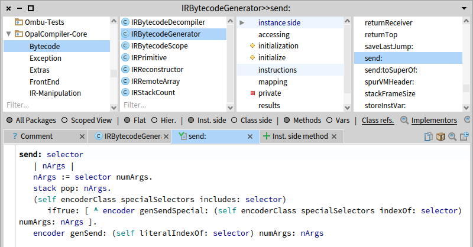
> *You can browse and modify the compiler on the fly*

## Moldable development tools

-   To be more productive, blacksmiths create custom tools for their tasks. Pharo shares the same philosophy. It allows you to create naturally dedicated tools for better understanding of your problems, supporting you in faster development

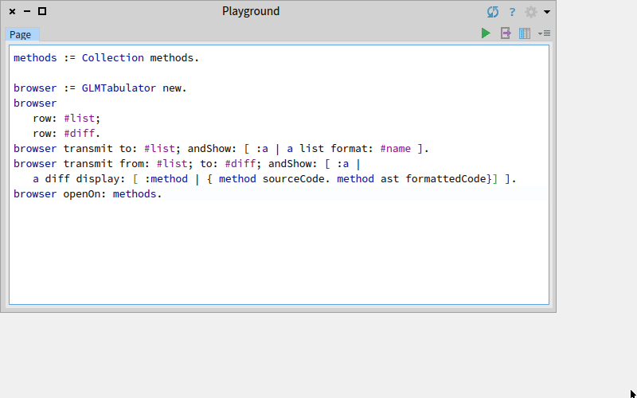
> *Write a small simple tool that shows differences between actual and automatically formatted codes inside the Pharo class Collection*

## Optional complete object memory persistence

-   All objects in the system can be stored at once in a platform-independent file named image. So you can, for example, save complete state of your program during debugging and restore it to try to find a different execution path or alternative solution.

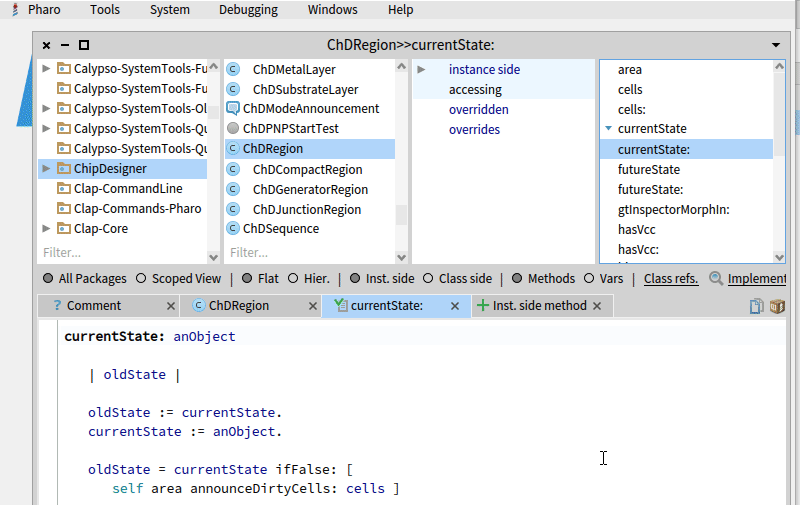
> *Install a breakpoint, run the application, and when the debugger appears, save the system state. Do some steps inside the debugger and then close Pharo. Recover the saved state and repeat the stepping.*

## Integrated Git support

-   Pharo has advanced integrated Git support that goes beyond the standard level of files. You can merge your branches on the granularity of particular methods, browse their history, create pull-requests directly from the IDE, and so on.

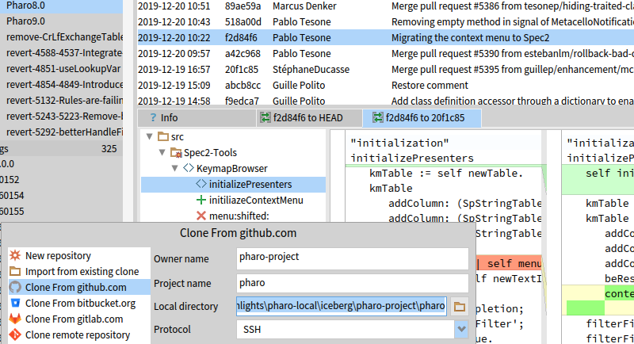
> *The built-in Git manager named Iceberg*

## Fast objects serialization

-   All objects, including classes or running contexts, can be serialized to a file. You can, for example, store the state of a debugger with the content of current stack and attach it to the issue report.

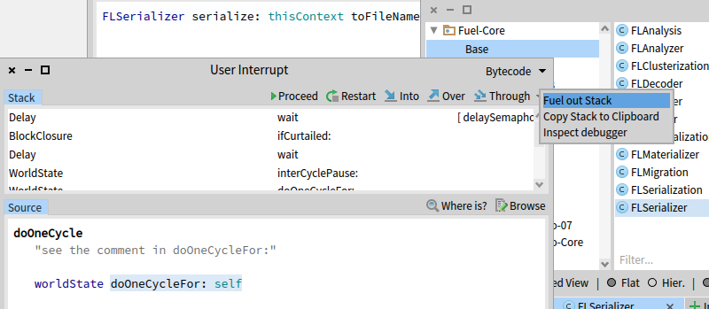
> *Saving of a class stack to a file*

## Arithmetic precision

-   Pharo can use fractions, scaled decimals, large integers and so on to work with numbers without loss of arithmetic precision.

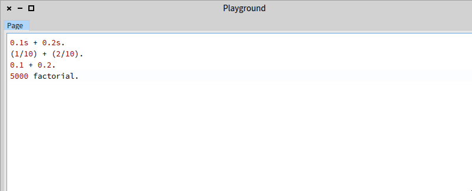
> *Pharo and the 0.30000000000000004 problem*

## Simple connection to native libraries

-   Pharo includes an FFI interface that makes the creation of bindings to C libraries very straightforward.

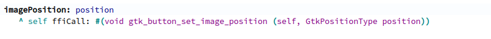
> *Part of the GTK binding. The definitions are very natural.*

## Easy use of proxy objects

-   Ability to easily create proxy objects - objects that process and/or resend all messages to another object, is essential to object-oriented languages.

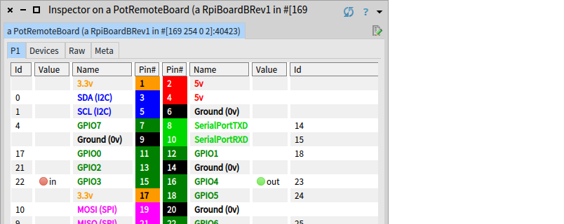

> *RaspberryPi GPIO ports displayed on a remote Pharo instance*

## Rigid system nature

-   In Pharo, the programmers have almost absolute freedom to customize the system and use many potentially dangerous features. On the other hand, most programmers will use them with deliberation, because Pharo, by default, provides a powerful standard library and tools that shape how to use the system the right way. Instead of making the language strict, it guides the programmers to do things right.

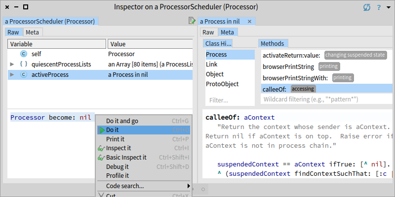

> *Not all messages are safe to send...*

## MIT license

-   Pharo is distributed with a non-viral open-source MIT license. The main Pharo repository is hosted on GitHub.

