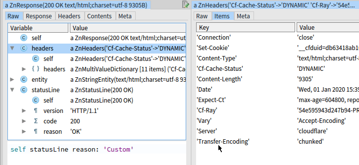

# Pharo key features

Pharo benefits from an elegant design that enables a relatively simple implementation of many advanced programming techniques.

## The optional fusion of a developed program and development environment

-   in Pharo, the border between your program and IDE can be eliminated. That means that you may directly use your code for a visual representation of your data structures during debugging, easily modify the built-in tools to fit your needs etc.

## Advanced run-time reflectivity

-   Pharo exposes everything to the programmer. Every object in the system can be examined and changed with respect to the object encapsulation rules

-   Pharo can enumerate all objects that have reference to some object

## Pure object-oriented approach

-   in Pharo, everything is an object. This purity and uniformity in the system and language design makes Pharo clean and comfortable to learn.

## Software as objects

-   Pharo uses files for serialization of source codes but, by default, it does not use files to edit them. Instead of a text editor, it provides the tools to browse and modify the classes, methods, class comments and other program entities. So Pharo has a much better understanding of relations between them and allows easier navigation and refactorings

## Simple language syntax

-   the language syntax has only six reserved words
-   the grammar is LL(1), it is very fast to parse
-   easy to learn
-   Pharo designed for messages passing without arguments ambiguity

## Closures with non-local returns

-   the closures in Pharo with non-local returns allow elegant implementation of control structures without need of defining them in the language itself. Pharo is a simple meta-language where the programmer has all features required for the writing of custom readable domain-specific languages

## Immediate objects identity swapping

-   in Pharo, you can easily replace an object with another one. All references to the old object in your running program will be replaced by references to the new object

## Fast resumable exceptions

-   Pharo provides advanced exceptions system that can do things like resuming from a raised exception with providing an alternative result so your program can recover from failures.
-   their fast speed allows them to be used for clean information-flow mechanisms

## Live customizable objects inspection

-   you can visualize your objects in many ways (textual form, graphical representation) and use it to inspect the state of your running program. Debuggers can use these visualizations to help you to your understanding

## Run-time classes and objects migration

-   Pharo can evolve while it lives. It is like an organism. You can do things like add or remove instance variables of classes that have already existing instances. All these living instances will be properly modified.

## Dynamic inheritance

-   you can change the definition of existing classes including changing of its superclass. To some selected object, you can simply assign different class and do similar operations. These capabilities are essential for the ability of the system to evolve without the need for restarts

## Advanced fast multi-platform virtual machine with JIT, combined generational garbage collector, ephemerons, forwarders

-   Pharo uses a very fast virtual machine with many unique features that runs on Windows, macOS and Linux including the ARM processors

## Virtual machine written mostly in the language itself

-   for more natural understanding and debugging of the virtual machine, it is mostly written in Pharo

## Easy call stack manipulation

-   you can easily inspect, modify or serialize the call stack. This allows, among other things, much easier building of debugging tools

## Continuations

-   call stack manipulation allows surprisingly easy implementation of continuations without the need for direct support of the virtual machine. The continuations are very handy for web development tasks and backtracking implementation

## Fast objects enumeration

-   with the Pharo reflection, you can easily enumerate all existing instances of a particular class and investigate references to them. It is beneficial for memory leaks detection. It is an essential Pharo reflectivity feature

## Objects as methods

-   methods are objects and objects can serve as methods. In this case, the invoking of a method means that the object receives a special message. It may be used for example during the coverage testing. You replace all class methods with such proxy objects, and when called, these objects replace themselves with the original method and write this information to a log

## Traits

-   Pharo classes use single inheritance, but they can use stateful traits for sharing of behavior with other classes

## Optional Green threads

-   Pharo includes own process management that allows using concurrent programming even on platforms that do not support it

## AST metalinks

-   abstract syntax tree of methods can be extended by metalinks that enable to do additional operations before, after or instead of particular AST nodes. That allows the clean first-class implementation of features like breakpoints, coverage testing, slots etc.

## First-class customizable instance variables

-   the metalinks allow the implementation of much smarter instance variables like variables that keep bidirectional managed references between two objects

## Customizable metaclasses

-   objects have classes and classes have classes too, the metaclasses. These metaclasses have a class too, and Pharo allows to use the custom ones. It allows having the implementation of language features like traits as standalone libraries without any direct support in the virtual machine.

## Relatively low memory consumption

-   Pharo, including the virtual machine, is very compact with fast startup time

## Platform-independent user interface

-   The default Pharo UI looks and behaves the same way on all platforms

## Customizable compiler

-   the compiler is written in Pharo, and you can modify it as anything else in the system. You can use completely different compilers for some of your classes

## Moldable development tools

-   to be more productive, the blacksmiths create custom tools for their tasks. The Pharo shares the same philosophy. It allows you to create naturally dedicated tools for better understanding of your problems and support you in faster development

## Optional complete object memory persistence

-   all objects in the system can be stored at once in a platform-independent file named image. So you can, for example, save complete state of your program during debugging and restore it to try to find different execution path or alternative solution

## Integrated Git support

-   Pharo has advanced integrated Git support that goes beyond the standard level of files. You can merge your branches on the granularity of particular methods, browse their history, create pull-requests directly from the IDE and so on.

## Iast objects serialization

-   all objects, including classes or running contexts, can be serialized to a file. You can, for example, store the state of a debugger with the content of current stack and attach it to the issue report�

## Easy use of proxy objects

-   ability to easily create proxy objects - objects that process and resend all messages to another object, is essential to object-oriented languages

## Simple connection to native libraries

-   Pharo includes FFI interface that makes the creation of bindings to C libraries very straightforward

## Rigid system nature

-   in Pharo, the programmers have almost absolute freedom to customize the system and use many potentially dangerous features. On the other hand, most programmers will use them with deliberation because Pharo, by default, provides a powerful standard library and tools that shape the way how to use the system the right way. Instead of making the language strict, it guides the programmers to do the things right.